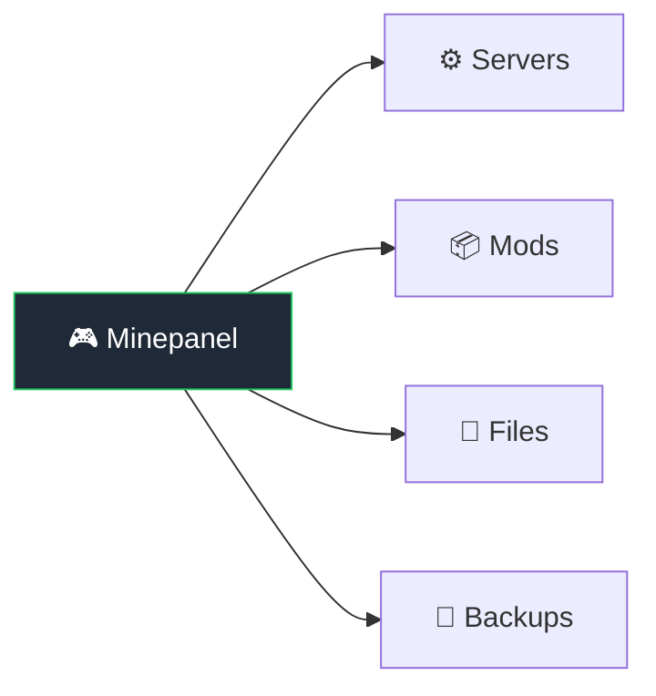

# Features




## Server Management

| Feature          | Description                                                          |
| ---------------- | -------------------------------------------------------------------- |
| Java & Bedrock   | Both Minecraft editions supported                                    |
| Multiple servers | Run as many as hardware allows, isolated containers                  |
| All server types | Vanilla, Paper, Forge, Neoforge, Fabric, Purpur, GTNH, CurseForge, Modrinth and Feed The Beast (FTB) modpacks |
| Any version      | 1.8 to latest, snapshots included                                    |
| Templates        | Pre-configured: Survival, Creative, SkyBlock, PvP, Bedrock presets, and Paper cross-play |
| Java defaults    | Global defaults for new Java servers (offline mode, resources, backup switch) |
| Resource limits  | Set RAM, CPU per server                                              |
| Clone server     | Duplicate a server's configuration under a new ID (world data and files are not copied) |

## Real-time Monitoring

| Feature   | Description                               |
| --------- | ----------------------------------------- |
| Dashboard | Home cards show status, players, uptime, CPU and RAM; a running server's header adds the game version |
| Live logs | Streaming, errors highlighted, searchable |
| Log export | Download the last 10,000 log lines as a `.log` file from the Logs tab |
| Stats     | CPU%, RAM%, player count, uptime, game version |
| History   | Per-server CPU/RAM graphs (1h–72h) in the Metrics tab, sampled every minute with 7-day retention |
| Alerts    | Opt-in Discord alerts per server: unexpected server down, and sustained high CPU/RAM above configurable thresholds (Metrics tab; requires the Discord webhook from Settings > Integrations) |

Runtime stats refresh on their own on the home page and the server page, and only render for
running servers. Player totals and version come from a game status query that works on both Java
and Bedrock. If the container is up but the game is not answering yet, those values stay blank
instead of reporting zero players.

On a running server, the compact header address menu lists the configured proxy hostname first,
followed by public and LAN addresses. If no LAN address is configured, Minepanel can use the
private address currently serving the dashboard as a local fallback. Selecting an address copies
it on both HTTPS and local HTTP deployments.

## Server Control

| Feature        | Description                                               |
| -------------- | --------------------------------------------------------- |
| Basic controls | Start, Stop, Restart, Delete                              |
| Force stop     | Stops now instead of waiting for the shutdown announcement (`STOP_SERVER_ANNOUNCE_DELAY`, 60s by default). Sends `stop` over RCON so the world is still saved, and kills the container after 10s if it does not exit |
| Console        | RCON (Java) or send-command (Bedrock)                     |
| Quick actions  | Save world, toggle whitelist, set time/weather, broadcast |
| Scheduled tasks | Auto restarts and scheduled console commands, per server in the Tasks tab. Schedule by fixed interval or standard 5-field cron expression (e.g. `0 4 * * *` = daily at 04:00, backend timezone) |

## Roles and Access Control

This is the first phase of Minepanel roles.

| Feature | Description |
| ------- | ----------- |
| `ADMIN` role | Full panel access without permission restrictions |
| `USER` role | Access limited by explicit permissions |
| `manageUsers` permission | Lets delegated operators manage users, invitations, and audit access without full admin rights |
| Server access | All servers or selected server assignments |
| Logs vs console | Separate permissions for viewing logs and sending commands |
| File access | Separate permissions for global files and per-server files |
| Invitations | New users join through invitation links, with optional SMTP delivery |
| Audit log | Filterable activity history for account, invitation, and server actions |

### Authorization model

- The frontend can hide or show sections for convenience, but the backend is the real permission boundary.
- Minepanel keeps authentication in `httpOnly` cookies and does not rely on `localStorage` for authorization.
- The current user/session can be cached briefly **in memory only** to reduce repeated calls such as `/auth/me` or `/users/one`.
- Every protected backend route still resolves the current user and re-checks the required permission before returning data or executing the action.

### Audit coverage

The current audit phase includes:

- login
- invitation creation, copy, and acceptance
- password changes
- email change request and confirmation
- user access updates and deletion
- server configuration saves
- server start, stop, and restart
- console command execution

## Player Management

| Feature        | Description                                |
| -------------- | ------------------------------------------ |
| Online players | View, kick, ban, change gamemode, teleport |
| Whitelist      | Add/remove players                         |
| Operators      | Manage OPs from panel                      |
| Ban list       | View reasons, unban                        |

## Mod & Plugin Support

| Feature    | Description                          |
| ---------- | ------------------------------------ |
| Modrinth   | Auto-download, dependency resolution |
| CurseForge | Mods and modpacks                    |
| Combined   | Use both simultaneously              |
| In-panel search | Search and add mod slugs/IDs directly from the Mods tab |
| Cross-play template | One-click Paper preset with Geyser, Floodgate, ViaVersion, and UDP port 19132 |

**→ Details:** [Mods & Plugins](/mods-plugins)

## File Management

Built-in browser for each server under `servers/<id>/mc-data`:

- Upload/download files, with a live transfer panel (speed, ETA, cancel); folders are
  downloaded as a ZIP that streams while it is compressed, so only the transferred
  bytes are shown until it finishes
- Edit configs (syntax highlighting)
- Create/delete/rename
- Drag & drop support

Common paths:

- Worlds source library for world switching: `servers/<id>/worlds/`
- Shared World Library for all servers: `servers/.world/worlds/`
- Active level data: `mc-data/<LEVEL>/`
- Java mods: `mc-data/mods/`
- Java plugins (Paper/Spigot/Purpur/etc): `mc-data/plugins/`
- Core config files: `mc-data/server.properties`, `mc-data/eula.txt`

Operational notes:

- Uploading/changing worlds, mods, plugins, and most configs usually requires restart.
- World switching supports folders with `level.dat` and archives (`.zip`, `.tar`, `.tar.gz`, `.tgz`).
- A selected world can be removed again: click it a second time (or use Clear selection) and apply.
  The server goes back to its own world; the copy already on disk is not deleted.
- `WORLD` clone source is mounted read-only by Minepanel to avoid accidental source overwrites.
- World Library includes **Discover Worlds** to search CurseForge worlds and import remote ZIP/TAR URLs directly into `servers/.world/worlds/`.
- The World Library page lists what you already have as searchable cards, filterable by name and by the folder imports landed in. The file browser is still there, folded away, for uploading, renaming and deleting.
- Each Java server has its own **Worlds** tab for picking which world it runs, with the same search across its local worlds and the shared library. A selection saved while running is staged for the next restart and does not touch the active world.

**→ Full guide:** [Worlds](/worlds)

## Backups

| Feature   | Description           |
| --------- | --------------------- |
| Automatic | Schedule daily/weekly |
| Manual    | One-click backup      |
| Restore   | Select and restore    |
| Download  | Get backup files      |

Backup configuration is available in **Advanced -> Backup** (Java servers):

- `backupMethod`: `tar`, `rsync`, `restic`, `rclone`
- `backupInterval`, `backupInitialDelay`
- `backupPruneDays`, `backupDestDir`, `backupExcludes`
- `backupHostDir`: host path where backups are physically stored. Empty uses the global `BACKUP_BASE_DIR` or the default `${BASE_DIR}/servers/<id>/backups`
- `backupOnStartup`

Practical defaults:

- `backupMethod=tar`
- `backupInterval=24h`
- `backupPruneDays=7`
- `backupDestDir=/backups`

If you only need local compressed backups, start with `tar`. Use `restic` when you want encrypted, deduplicated backups on remote storage.

### Cloud backups (S3-compatible)

Selecting `backupMethod=restic` shows a **Restic repository** section where you configure a
remote destination. Any S3-compatible provider works:

| Provider     | Repository example                                        |
| ------------ | --------------------------------------------------------- |
| AWS S3       | `s3:https://s3.amazonaws.com/my-bucket/minecraft`          |
| MinIO        | `s3:https://minio.example.com:9000/minecraft-backups`      |
| Backblaze B2 | `s3:https://s3.us-west-002.backblazeb2.com/my-bucket`      |
| Wasabi       | `s3:https://s3.wasabisys.com/my-bucket`                    |
| Local path   | `/backups/restic` (stays on the host backups mount)        |

Fields:

- **Repository**: restic repository URL. `s3:` repositories also need the access/secret key fields.
- **Repository password**: encrypts the repository. Store it somewhere safe — without it snapshots cannot be restored.
- **Retention policy**: `restic forget` flags applied after each backup (default `--keep-within 7d`, e.g. `--keep-daily 7 --keep-weekly 4`).

The panel lists existing **snapshots** in the same section (the backup sidecar must be running).

::: warning Credentials on disk
Restic credentials are written to the server's generated `docker-compose.yml` under
`${BASE_DIR}/servers/<id>/` (same model as the RCON password). Use a dedicated bucket and
access keys scoped to it.
:::

Manual restore (until one-click restore ships):

```bash
# 1. List snapshots
docker exec <serverId>-backup restic snapshots

# 2. Stop the server from the panel, then restore into the data volume
docker exec <serverId>-backup restic restore latest --target /data
```

`/data` inside the backup container is the server's `mc-data` directory. Note the default
`/data` mount is read-only (`:ro`); for a restore, run a one-off container with the same
repository env vars and a writable mount instead:

```bash
docker run --rm \
  -e RESTIC_REPOSITORY=... -e RESTIC_PASSWORD=... \
  -e AWS_ACCESS_KEY_ID=... -e AWS_SECRET_ACCESS_KEY=... \
  -v ${BASE_DIR}/servers/<serverId>/mc-data:/data \
  restic/restic restore latest --target /
```

## Configuration

Edit from UI:

- Server name, MOTD
- Max players, difficulty, game mode
- View distance, PVP, command blocks
- Spawn protection radius (Java, `SPAWN_PROTECTION`; `0` disables it)
- JVM arguments, extra flags

Settings are grouped by the question you are asking, not by where the value is
stored: **Type**, **Game**, **Worlds**, **Access**, **Network**, **Resources**,
**Lifecycle**, mods/plugins/addons, **Backups** and **Advanced**. Configuration tabs
remain available while the server is running. You can save ordinary configuration,
including mods, player access, resources and backups, without recreating the live
containers. Minepanel applies those saved values on the next server restart.

**Network** stays read-only while running because proxy-route changes can affect
live connections. RCON credentials stay read-only so Commands keep using the port
and password loaded by the active container. **Bedrock add-ons** and **Files** also
stay read-only because they write into the active server data. You can inspect
these settings before deciding whether to stop the server. Logs, metrics and
scheduled tasks stay available; commands need the server up.

A **Simple / Advanced** toggle above the tabs decides how much is shown. Simple
hides Network, Lifecycle and Advanced plus the JVM options, unless the server
already has something set in one of them — a tab you have configured is never
hidden. The choice is per browser and applies to every server. Ctrl/Cmd+K opens a
palette that jumps straight to any tab or setting by name.

## Server Resources (Java)

In **Resources** tab:

- **Memory/CPU:** set `INIT_MEMORY`, `MAX_MEMORY`, and CPU limits per server
- **JVM Options:** use `JVM_OPTS`, `JVM_XX_OPTS`, `JVM_DD_OPTS`, `EXTRA_ARGS`

Timezone, auto-stop, auto-pause, restart policy and rolling logs live in the
**Lifecycle** tab.

Recommended approach:

1. Set only `INIT_MEMORY` and `MAX_MEMORY` first.
2. Enable Aikar flags if you do not have a custom JVM tuning profile.
3. Change `JVM_XX_OPTS` only when you have measured a performance issue.

## Other

| Feature          | Description                               |
| ---------------- | ----------------------------------------- |
| Multi-language   | EN, ES, NL, DE, FR, PL, RU, PT            |
| Multi-arch       | x86_64, ARM64 (Pi, Apple Silicon)         |
| Discord webhooks | Server event notifications                |
| MC Proxy Router  | Single port for Java servers via hostname; started and configured by the panel |
| Proxy auto-scaling | Stop proxied Java servers while empty, wake them on the first connection, with a per-server opt-out |
| Update notices   | Release notes for every version between yours and the newest, flagged when a change is breaking |
| One-click update | Admins can pull and recreate the stack from the panel, with automatic rollback if it does not come back |
| End Portal expedition | Optional desktop-only 3D easter egg in Settings > Danger Zone; find and click the portal to return |

## Edition Comparison

| Feature       | Java Edition                | Bedrock Edition         |
| ------------- | --------------------------- | ----------------------- |
| Server Types  | Vanilla, Paper, Forge, etc. | Vanilla only            |
| Default Port  | 25565 (TCP)                 | 19132 (UDP)             |
| Commands      | RCON console                | send-command (via logs) |
| Proxy Support | Yes (mc-router)             | No                      |
| Mods/Plugins  | Full support                | Addons/Behavior Packs   |
| Backups       | Full support                | Full support            |

::: tip Bedrock Commands
Bedrock servers use `send-command` instead of RCON. Command output appears in server logs rather than returning directly.
:::

## Coming Soon

- Export logs from the log viewer
- Dedicated `server.properties` editor with validation
- Cron-style scheduling (specific times) for scheduled tasks
- Bedrock console commands

**→ Full roadmap:** [Roadmap](/roadmap)
